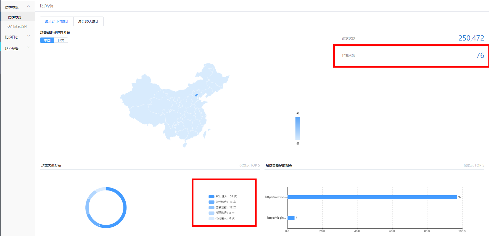

#### 自动化获取云盾WAF页面数据

利用技术：headless-chrome，pyppeteer

背景：统计每日的WAF数据是平时的安全运营工作之一，每天要统计WAF攻击TOP5数据和拦截数据，参考下图



在运营一个云盾账号的时候，没必要写脚本来实现，每天手动登录云盾统计一下也并不是繁琐的事情。

但是，如果是运营多个云盾账号，先登录一个账号统计完WAF数据之后再退出重新登录第二个账号，依次类推，账号越多越繁琐。但这些又是重复性的工作，完全可以通过脚本代替人工进行统计。

实现主要分3步：

1.模拟登录获取cookie

2.使用cookie访问WAF数据接口

3.将WAF数据通过正则提取出来，写入表格

方便演示浏览器操作过程，launch()设置了headless=False


目录下需要存在result.csv文件，因为open file方式是a

通过crontab -e 写入一个计划任务，每日下午5点半自动执行脚本，这样做的好处就是，周末的数据也可以统计到

```
30 5 * * * python3 /root/waf_deny_top5/wafdata.py
```

